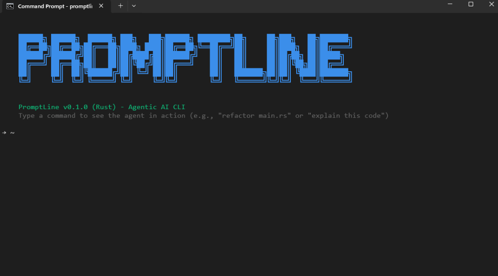

# PromptLine 🚀

**The Agentic AI CLI for Developers.**



PromptLine is a powerful, Rust-based CLI tool that brings agentic AI capabilities directly to your terminal. It's designed to help you write code, run commands, manage projects, and automate tasks using natural language.

## ✨ Features

*   **Agentic Workflow**: Plan, execute, and verify tasks with an intelligent AI agent.
*   **Interactive Chat**: Chat with the agent in a REPL environment with autocomplete and history.
*   **Tool Integration**:
    *   📂 **File Operations**: Read, write, and list files.
    *   🐚 **Shell Execution**: Run system commands safely.
    *   🔍 **Codebase Search**: Search your project for code snippets.
    *   🌐 **Web Access**: Fetch content from the web.
    *   🌳 **Git Integration**: Check status, diffs, and commits.
*   **Project Scaffolding**: Automatically creates directories for new projects while respecting existing ones.
*   **Safety First**: Configurable permission system (Ask, Allow, Deny) for sensitive actions.
*   **Model Agnostic**: Supports OpenAI and Ollama (local LLMs).

## 📦 Installation

### Prerequisites

*   **Rust**: Ensure you have Rust installed (`cargo`).
*   **API Key**: You need an OpenAI API key OR a running Ollama instance.

### Build from Source

1.  Clone the repository:
    ```bash
    git clone https://github.com/yourusername/promptline.git
    cd promptline
    ```

2.  Build and install:
    ```bash
    cargo install --path .
    ```

3.  Verify installation:
    ```bash
    promptline --version
    ```

## 🚀 Usage

### Quick Start

Start the interactive agent:

```bash
promptline
```

Or run a specific task directly:

```bash
promptline "Create a new Rust project called my-app"
```

### Configuration

PromptLine uses a configuration file at `~/.promptline/config.yaml`. You can configure:

*   **Model Provider**: OpenAI or Ollama.
*   **Permissions**: Control what the agent can do (e.g., require approval for shell commands).
*   **Safety**: Set max iterations and other safety limits.

To set your API key:

```bash
export OPENAI_API_KEY="your-api-key"
# OR for Ollama
export OLLAMA_API_KEY="your-key" # Optional
```

### Examples

*   **Scaffold a Project**:
    > "Make a login portal with HTML and CSS"
*   **Refactor Code**:
    > "Refactor src/main.rs to break the large function into smaller ones"
*   **Debug**:
    > "Run the tests and fix any failures"
*   **Explain**:
    > "Explain how the authentication flow works in this project"

## 🤝 Contributing

Contributions are welcome! Please feel free to submit a Pull Request.

1.  Fork the project
2.  Create your feature branch (`git checkout -b feature/AmazingFeature`)
3.  Commit your changes (`git commit -m 'Add some AmazingFeature'`)
4.  Push to the branch (`git push origin feature/AmazingFeature`)
5.  Open a Pull Request

## 📄 License

This project is licensed under the MIT License - see the [LICENSE](LICENSE) file for details.
