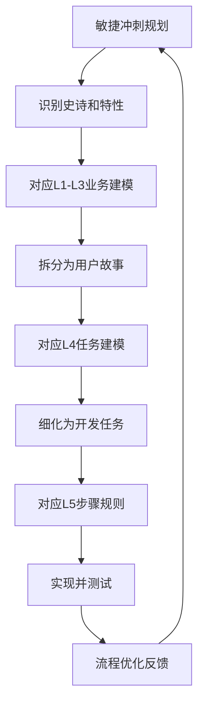

# 业务流程建模的分级体系：XPDL、五级建模、四色建模与敏捷开发的融合

您提到的XPDL、华为五级建模、银行业五级建模、敏捷开发和四色建模，确实构成了现代企业业务流程建模的完整生态系统。这些方法并非相互排斥，而是从不同维度、不同抽象层次对业务流程进行描述和管理的工具。

## 📊 主流分级建模体系对比

| 建模方法 | 核心目的 | 分级层次 | 适用场景 | 与XPDL关系 |
|-------------|-------------|-------------|-------------|---------------|
| 华为五级建模 | 企业流程体系化建设 | L1-L5：价值链→运作模式→业务能力→工作流→操作手册 | 大型企业数字化转型、流程标准化 | XPDL常用于L4工作流层实现 |
| 银行业五级建模 | 金融业务标准化 | 业务领域→业务阶段→活动→任务→步骤规则 | 银行业务流程梳理、监管合规 | XPDL支持L3-L5的流程交换 |
| 四色建模 | 领域模型设计 | 时标对象→角色→描述→实体 | 复杂业务领域分析、DDD实施 | 为XPDL提供业务语义基础 |
| 敏捷开发 | 迭代交付价值 | 史诗→特性→用户故事→任务 | 快速变化业务、创新产品开发 | XPDL可描述敏捷流程模板 |
| XPDL标准 | 流程定义交换 | 流程→活动→转移→参与者 | 跨系统流程集成、BPMN存储 | 标准化交换格式 |

## 🏗️ 华为五级建模体系详解

华为的五级流程体系是企业流程架构的经典框架：

### **L1：业务价值链**
• 定义：企业核心价值活动领域

• 示例：研发、营销、销售、服务、供应链

• 特点：端到端业务流，关注客户价值创造


### **L2：运作模式流程**
• 定义：运营模式层面的业务子流程

• 示例：产品研发流程、客户服务流程

• 特点：因业务场景不同而差异化


### **L3：业务能力/活动**
• 定义：实现运营模式所需的业务能力与活动

• 示例：需求分析、设计评审、测试验证

• 特点：与IT系统选用不直接相关


### **L4：工作流**
• 定义：业务与IT系统的交互过程/工作流

• 示例：OA审批流程、ERP业务流

• 特点：可结合特定IT系统，XPDL主要应用层


### **L5：业务/系统操作手册**
• 定义：基于特定IT系统的具体操作步骤

• 示例：SAP系统操作指南、CRM使用手册

• 特点：详细规范，指导具体执行


## 🏦 银行业五级建模实践

银行业基于TOGAF标准的五级建模方法：

### **一级：业务领域**
• 对应银行主要业务，分为核心业务和支撑业务

• 示例：信贷、存款（核心）；客户管理（支撑）


### **二级：业务阶段**
• 业务领域内部各价值环节，代表业务功能

• 示例：客户管理领域包含客户信息管理、客户服务管理


### **三级：活动**
• 企业级视角完成某个具有明确目的、创造价值的端到端流程

• 示例：采集客户信息包含从检索到收集、维护、审核的全流程


### **四级：任务**
• 描述部门或业务单位为完成三级流程所需不同角色完成的具有明确业务目的的事情

• 示例：维护客户信息是由同一角色连续完成的任务


### **五级：步骤规则**
• 描述员工为完成四级流程所需执行的具体步骤及业务规则

• 示例：维护客户信息包含维护基本信息、联络信息等功能


## 🎨 四色建模与业务流程的融合

四色建模（Color Modeling）是领域驱动设计（DDD）中的重要方法，为业务流程提供语义基础：

### **四色原型及其对应关系**
| 颜色 | 原型 | 业务含义 | 在五级建模中的对应 |
|---------|---------|-------------|---------------------|
| 粉红色 | 时标对象（Moment-Interval） | 业务关键时刻或时间段内发生的事件 | L3活动、L4任务 |
| 黄色 | 角色（Role） | 实体在特定上下文中的身份 | L4任务中的执行角色 |
| 蓝色 | 描述（Description） | 分类或描述信息，业务元数据 | L5步骤中的业务规则 |
| 绿色 | 参与方/地点/物品（Party/Place/Thing） | 业务中最稳定的核心实体 | L1-L2的业务对象 |

### **四色建模与五级建模的映射示例**
以银行业“贷款审批”流程为例：

1. 时标对象（粉红）：贷款申请提交、风险评估完成、审批通过
   • 对应L3活动：贷款申请处理、风险评估、审批决策


2. 角色（黄）：申请人、信贷员、风控专员、审批人
   • 对应L4任务：不同角色执行的具体任务


3. 描述（蓝）：贷款产品类型、风险等级标准、审批策略
   • 对应L5步骤规则：具体的业务规则和参数


4. 实体（绿）：客户、贷款合同、抵押物、银行账户
   • 对应L1-L2的业务领域对象


## 🔄 XPDL在分级建模中的角色

XPDL（XML Process Definition Language）作为WfMC的标准，在分级建模体系中扮演关键角色：

### **XPDL支持的分级元素**
```xml
<!-- XPDL流程定义示例 -->
<Package>
  <!-- L1-L2：流程包和流程 -->
  <WorkflowProcesses>
    <WorkflowProcess Id="LoanApprovalProcess" Name="贷款审批流程">
      
      <!-- L3：活动定义 -->
      <Activities>
        <Activity Id="RiskAssessment" Name="风险评估">
          <!-- L4：任务实现 -->
          <Implementation>
            <Task>
              <Performer>RiskOfficer</Performer>
            </Task>
          </Implementation>
          
          <!-- L5：步骤规则 -->
          <ExtendedAttributes>
            <ExtendedAttribute Name="BusinessRule" Value="RiskScore > 70"/>
            <ExtendedAttribute Name="StepSequence" Value="3"/>
          </ExtendedAttributes>
        </Activity>
      </Activities>
      
      <!-- 四色建模元素映射 -->
      <DataFields>
        <!-- 绿色实体 -->
        <DataField Id="Customer" IsArray="false"/>
        <DataField Id="LoanContract" IsArray="false"/>
        
        <!-- 蓝色描述 -->
        <DataField Id="LoanProductType" IsArray="false"/>
        <DataField Id="RiskLevelCriteria" IsArray="false"/>
      </DataFields>
      
      <!-- 黄色角色 -->
      <Participants>
        <Participant Id="Applicant" Name="申请人"/>
        <Participant Id="CreditOfficer" Name="信贷员"/>
        <Participant Id="RiskOfficer" Name="风控专员"/>
      </Participants>
    </WorkflowProcess>
  </WorkflowProcesses>
</Package>
```

### **XPDL的分级支持能力**
1. 流程层次化：支持子流程嵌套，对应L1-L3的层次结构
2. 活动细化：活动可分解为任务和步骤，对应L4-L5
3. 角色管理：参与者定义，支持四色建模中的角色概念
4. 数据建模：数据字段定义，支持实体和描述对象
5. 规则集成：扩展属性支持业务规则定义

## 🚀 敏捷开发与分级建模的融合

敏捷开发并非排斥分级建模，而是提供不同的抽象层次：

### **敏捷需求层级与建模对应**
| 敏捷层级 | 对应建模层级 | 描述 | 示例 |
|-------------|-----------------|---------|---------|
| 史诗（Epic） | L1业务领域/L2业务阶段 | 大型业务能力或价值流 | "实现跨境支付平台" |
| 特性（Feature） | L3活动 | 可交付的业务价值单元 | "支持B2B跨境汇款" |
| 用户故事（User Story） | L4任务 | 从用户角度描述的功能 | "作为企业财务，我希望批量上传付款指令" |
| 任务（Task） | L5步骤 | 具体的开发或测试任务 | "实现付款指令解析服务" |

### **敏捷迭代中的建模应用**


## 🎯 综合应用框架：五级建模+XPDL+四色+敏捷

### **分层实施策略**
```yaml
# 企业级业务流程建模框架
架构层级:
  - 战略层(L1-L2):
      - 方法: 华为五级建模/银行业五级建模
      - 产出: 业务价值链图、流程领域划分
      - 工具: ArchiMate、价值链分析
  
  - 设计层(L3-L4):
      - 方法: 四色建模+敏捷用户故事
      - 产出: 领域模型、用户故事地图
      - 工具: BPMN、四色建模工具
  
  - 实现层(L4-L5):
      - 方法: XPDL+BPMN执行
      - 产出: 可执行流程定义、操作手册
      - 工具: 流程引擎、XPDL编辑器
  
  - 运营层:
      - 方法: 敏捷迭代+持续改进
      - 产出: 流程指标、优化建议
      - 工具: 流程挖掘、监控平台
```

### **实际工作流程示例**
以"跨境支付"业务为例：

1. L1价值链识别：跨境支付服务
2. L2流程域划分：汇出汇款、汇入汇款、换汇、清结算
3. L3活动定义：B2B付款流程、C2C汇款流程
4. 四色建模分析：
   • 时标对象：支付指令创建、风控审核通过、换汇执行完成

   • 角色：付款人、收款人、风控专员、结算操作员

   • 描述：支付渠道、汇率规则、手续费标准

   • 实体：客户账户、支付指令、结算记录

5. XPDL实现：将L3-L4流程转换为可执行的XPDL定义
6. 敏捷交付：按用户故事拆分，迭代实现

## 💡 最佳实践建议

### **1. 分层协作模式**
• 业务架构师：负责L1-L2战略层建模

• 业务分析师：负责L3-L4设计层，结合四色建模

• 流程工程师：负责L4-L5实现层，使用XPDL/BPMN

• 开发团队：基于敏捷用户故事进行迭代开发


### **2. 工具链整合**
```
业务建模工具(Bizagi/ARIS) → 导出BPMN/XPDL → 
流程引擎(Camunda/Flowable) → 执行监控 → 
流程挖掘(Celonis) → 优化反馈
```

### **3. 治理机制**
• 模型版本管理：确保各层级模型的一致性

• 变更控制：层级间变更的联动管理

• 质量检查：定期验证模型与实际业务的一致性

• 持续改进：基于运营数据优化流程模型


### **4. 成功关键因素**
1. 顶层设计先行：从L1价值链开始，确保业务对齐
2. 渐进式细化：逐层分解，避免过早陷入细节
3. 跨团队协作：业务、IT、运营团队共同参与
4. 工具标准化：统一建模语言和工具链
5. 持续验证：通过实际执行验证模型有效性

## 📈 行业应用趋势

根据最新实践，现代企业越来越倾向于混合建模方法：
• 大型传统企业：华为/银行业五级建模提供结构框架

• 互联网/敏捷组织：四色建模+敏捷提供灵活性

• 技术实现层：XPDL/BPMN确保跨系统互操作性

• 监管严格行业：分级建模满足审计和合规要求


这种分层、分级的建模方法不仅帮助组织理解和管理复杂业务流程，还为数字化转型提供了清晰的路线图。通过将战略级的五级建模、设计级的四色建模、执行级的XPDL和交付级的敏捷开发有机结合，企业可以构建既稳健又灵活的业务流程管理体系。