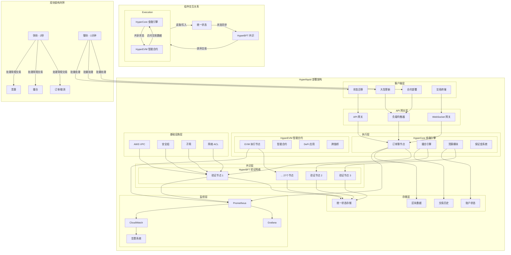
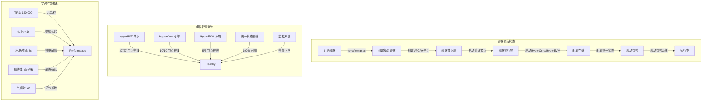

# Hyperliquid 部署架构 DSL 表达与可视化

基于 Hyperliquid 的高性能 Layer-1 区块链架构，以下是使用 Terraform HCL 表达的完整部署架构设计，以及对应的 Mermaid.js 可视化图表。

## 🏗️ Hyperliquid 核心架构概览

Hyperliquid 是一个专为金融交易设计的 Layer-1 区块链，其架构包含三个核心组件：
• HyperBFT：定制的拜占庭容错共识机制，提供亚秒级最终性

• HyperCore：专门用于金融应用的链上引擎，处理订单簿、撮合、清算

• HyperEVM：EVM 兼容执行环境，支持智能合约开发


## 📋 部署架构 DSL 表达（Terraform HCL）

```hcl
# hyperliquid/main.tf - 主配置文件
terraform {
  required_version = ">= 1.5.0"
  required_providers {
    aws = {
      source  = "hashicorp/aws"
      version = "~> 5.0"
    }
    kubernetes = {
      source  = "hashicorp/kubernetes"
      version = "~> 2.23"
    }
  }

  backend "s3" {
    bucket         = "hyperliquid-tf-state"
    key            = "production/terraform.tfstate"
    region         = "ap-northeast-1"
    encrypt        = true
    dynamodb_table = "hyperliquid-tf-locks"
  }
}

# 变量定义
variable "environment" {
  description = "部署环境 (production, staging, testnet)"
  type        = string
  default     = "production"
}

variable "validator_count" {
  description = "验证节点数量"
  type        = number
  default     = 27  # 根据2025年初数据
}

variable "hypercore_node_count" {
  description = "HyperCore 执行节点数量"
  type        = number
  default     = 10
}

variable "hyperevm_node_count" {
  description = "HyperEVM 执行节点数量"
  type        = number
  default     = 5
}

# 提供者配置
provider "aws" {
  region = "ap-northeast-1"
  default_tags {
    tags = {
      Project     = "Hyperliquid"
      Environment = var.environment
      ManagedBy   = "Terraform"
      Component   = "Blockchain-Infrastructure"
    }
  }
}

# 网络模块
module "network" {
  source = "./modules/network"
  
  environment = var.environment
  vpc_cidr    = "10.0.0.0/16"
  
  public_subnets = [
    "10.0.1.0/24",
    "10.0.2.0/24",
    "10.0.3.0/24"
  ]
  
  private_subnets = [
    "10.0.11.0/24",
    "10.0.12.0/24",
    "10.0.13.0/24"
  ]
}

# 共识层 - HyperBFT 验证节点
module "hyperbft_validators" {
  source = "./modules/hyperbft"
  
  environment     = var.environment
  node_count      = var.validator_count
  instance_type   = "c6i.4xlarge"
  subnet_ids      = module.network.private_subnet_ids
  security_groups = [module.network.validator_sg_id]
  
  # HyperBFT 配置
  consensus_config = {
    block_time        = "2s"      # 快块出块时间
    finality_delay    = "1s"      # 亚秒级最终性
    max_validators    = 100
    min_stake_amount  = "1000000000000000000"  # 1 HYPE
  }
}

# 执行层 - HyperCore 金融引擎
module "hypercore_nodes" {
  source = "./modules/hypercore"
  
  environment     = var.environment
  node_count      = var.hypercore_node_count
  instance_type   = "c6i.2xlarge"
  subnet_ids      = module.network.private_subnet_ids
  security_groups = [module.network.hypercore_sg_id]
  
  # HyperCore 配置
  hypercore_config = {
    orderbook_enabled    = true
    perpetual_markets    = ["BTC", "ETH", "SOL"]
    spot_markets         = ["BTC", "ETH", "USDC"]
    max_orders_per_second = 200000  # 目标吞吐量
    matching_engine      = "clob"   # 中央限价订单簿
  }
  
  # 连接到 HyperBFT 验证节点
  validator_endpoints = module.hyperbft_validators.validator_endpoints
}

# 执行层 - HyperEVM 智能合约环境
module "hyperevm_nodes" {
  source = "./modules/hyperevm"
  
  environment     = var.environment
  node_count      = var.hyperevm_node_count
  instance_type   = "c6i.large"
  subnet_ids      = module.network.private_subnet_ids
  security_groups = [module.network.hyperevm_sg_id]
  
  # HyperEVM 配置
  hyperevm_config = {
    chain_id          = 999        # HyperEVM Chain ID
    evm_compatibility = "london"
    gas_token         = "HYPE"
    rpc_endpoint      = "https://rpc.hyperliquid.xyz/evm"
  }
  
  # 连接到统一状态
  state_endpoints = module.hypercore_nodes.state_endpoints
}

# 存储层 - 统一状态存储
module "unified_state_storage" {
  source = "./modules/storage"
  
  environment = var.environment
  storage_type = "s3"
  
  # 存储配置
  storage_config = {
    bucket_name          = "hyperliquid-state-${var.environment}"
    versioning_enabled   = true
    encryption_enabled   = true
    lifecycle_rules = [
      {
        id      = "archive"
        enabled = true
        transition = {
          days          = 30
          storage_class = "GLACIER"
        }
      }
    ]
  }
  
  # 连接所有组件
  hyperbft_access = module.hyperbft_validators.storage_access
  hypercore_access = module.hypercore_nodes.storage_access
  hyperevm_access = module.hyperevm_nodes.storage_access
}

# 监控与可观测性
module "monitoring" {
  source = "./modules/monitoring"
  
  environment = var.environment
  
  # 监控目标
  monitoring_targets = {
    hyperbft_validators = module.hyperbft_validators.monitoring_endpoints
    hypercore_nodes     = module.hypercore_nodes.monitoring_endpoints
    hyperevm_nodes      = module.hyperevm_nodes.monitoring_endpoints
  }
  
  # 告警配置
  alert_config = {
    block_height_stalled = {
      threshold = 0
      period    = "5m"
    }
    tps_drop = {
      threshold = 100000  # 低于10万订单/秒
      period    = "1m"
    }
    validator_health = {
      threshold = 80  # 至少80%验证节点健康
      period    = "2m"
    }
  }
}

# 输出配置
output "hyperbft_endpoints" {
  value = module.hyperbft_validators.public_endpoints
}

output "hypercore_rpc_endpoint" {
  value = module.hypercore_nodes.rpc_endpoint
}

output "hyperevm_rpc_endpoint" {
  value = module.hyperevm_nodes.rpc_endpoint
}

output "monitoring_dashboard" {
  value = module.monitoring.dashboard_url
}
```

## 🎨 可视化架构图（Mermaid.js）



## 🔧 模块化架构设计

### **1. 网络模块 (`modules/network`)**
```hcl
# modules/network/main.tf
resource "aws_vpc" "main" {
  cidr_block = var.vpc_cidr
  
  tags = {
    Name = "hyperliquid-${var.environment}-vpc"
  }
}

resource "aws_security_group" "validator_sg" {
  name        = "hyperbft-validator-sg"
  description = "HyperBFT 验证节点安全组"
  
  ingress {
    description = "HyperBFT 共识端口"
    from_port   = 4001
    to_port     = 4001
    protocol    = "tcp"
    cidr_blocks = [var.vpc_cidr]
  }
}

resource "aws_security_group" "hypercore_sg" {
  name        = "hypercore-sg"
  description = "HyperCore 执行节点安全组"
  
  ingress {
    description = "RPC 端口"
    from_port   = 8545
    to_port     = 8545
    protocol    = "tcp"
    cidr_blocks = ["0.0.0.0/0"]
  }
}
```

### **2. HyperBFT 共识模块 (`modules/hyperbft`)**
```hcl
# modules/hyperbft/main.tf
resource "aws_instance" "validator" {
  count = var.node_count
  
  ami           = data.aws_ami.ubuntu_24_04.id
  instance_type = var.instance_type
  
  subnet_id              = element(var.subnet_ids, count.index % length(var.subnet_ids))
  vpc_security_group_ids = var.security_groups
  
  user_data = templatefile("${path.module}/templates/validator-init.sh", {
    node_index    = count.index
    environment   = var.environment
    validator_key = aws_kms_key.validator_key[count.index].key_id
  })
  
  tags = {
    Name        = "hyperbft-validator-${count.index}"
    Role        = "validator"
    Environment = var.environment
  }
}

# HyperBFT 配置
resource "local_file" "hyperbft_config" {
  content = yamlencode({
    consensus = {
      algorithm = "hyperbft"
      block_time = var.consensus_config.block_time
      finality_delay = var.consensus_config.finality_delay
      max_validators = var.consensus_config.max_validators
    }
    network = {
      peer_discovery = "dns"
      listen_addr = "0.0.0.0:4001"
    }
    state = {
      sync_mode = "fast"
      prune_mode = "full"
    }
  })
  
  filename = "${path.module}/config/hyperbft-${var.environment}.yaml"
}
```

### **3. HyperCore 执行模块 (`modules/hypercore`)**
```hcl
# modules/hypercore/main.tf
resource "aws_instance" "hypercore_node" {
  count = var.node_count
  
  ami           = data.aws_ami.ubuntu_24_04.id
  instance_type = var.instance_type
  
  subnet_id              = element(var.subnet_ids, count.index % length(var.subnet_ids))
  vpc_security_group_ids = var.security_groups
  
  user_data = templatefile("${path.module}/templates/hypercore-init.sh", {
    node_index      = count.index
    environment     = var.environment
    validator_nodes = join(",", var.validator_endpoints)
    orderbook_type  = var.hypercore_config.matching_engine
  })
  
  root_block_device {
    volume_size = 500
    volume_type = "gp3"
    encrypted   = true
  }
  
  tags = {
    Name        = "hypercore-node-${count.index}"
    Role        = "execution"
    Engine      = "hypercore"
    Environment = var.environment
  }
}

# 订单簿配置
resource "local_file" "orderbook_config" {
  content = jsonencode({
    markets = {
      perpetual = var.hypercore_config.perpetual_markets
      spot      = var.hypercore_config.spot_markets
    }
    matching = {
      engine    = var.hypercore_config.matching_engine
      tick_size = "0.01"
      lot_size  = "0.001"
    }
    risk = {
      max_leverage    = 20
      margin_requirement = "0.05"
      liquidation_ratio = "0.8"
    }
  })
  
  filename = "${path.module}/config/orderbook-${var.environment}.json"
}
```

### **4. HyperEVM 执行模块 (`modules/hyperevm`)**
```hcl
# modules/hyperevm/main.tf
resource "aws_instance" "hyperevm_node" {
  count = var.node_count
  
  ami           = data.aws_ami.ubuntu_24_04.id
  instance_type = var.instance_type
  
  subnet_id              = element(var.subnet_ids, count.index % length(var.subnet_ids))
  vpc_security_group_ids = var.security_groups
  
  user_data = templatefile("${path.module}/templates/hyperevm-init.sh", {
    node_index      = count.index
    environment     = var.environment
    chain_id        = var.hyperevm_config.chain_id
    rpc_endpoint    = var.hyperevm_config.rpc_endpoint
    state_endpoints = join(",", var.state_endpoints)
  })
  
  root_block_device {
    volume_size = 200
    volume_type = "gp3"
    encrypted   = true
  }
  
  tags = {
    Name        = "hyperevm-node-${count.index}"
    Role        = "execution"
    Engine      = "hyperevm"
    Environment = var.environment
  }
}

# EVM 配置
resource "local_file" "evm_config" {
  content = tomlencode({
    [evm]
    chain-id = var.hyperevm_config.chain_id
    homestead-block = 0
    eip150-block = 0
    eip155-block = 0
    eip158-block = 0
    byzantium-block = 0
    constantinople-block = 0
    petersburg-block = 0
    istanbul-block = 0
    berlin-block = 0
    london-block = 0
    
    [rpc]
    http-enabled = true
    http-addr = "0.0.0.0"
    http-port = 8545
    ws-enabled = true
    ws-addr = "0.0.0.0"
    ws-port = 8546
    
    [state]
    sync-mode = "fast"
    cache-size = 4096
  })
  
  filename = "${path.module}/config/evm-${var.environment}.toml"
}
```

## 📊 部署状态可视化



## 🚀 部署执行脚本

```bash
#!/bin/bash
# deploy-hyperliquid.sh

set -e

ENVIRONMENT=${1:-"staging"}
ACTION=${2:-"apply"}

echo "🚀 部署 Hyperliquid ${ENVIRONMENT} 环境..."

# 1. 初始化 Terraform
echo "📦 初始化 Terraform..."
terraform init -backend-config="environments/${ENVIRONMENT}/backend.hcl"

# 2. 选择工作空间
echo "🔧 选择工作空间: ${ENVIRONMENT}"
terraform workspace select "${ENVIRONMENT}" || terraform workspace new "${ENVIRONMENT}"

# 3. 验证配置
echo "✅ 验证配置..."
terraform validate

# 4. 计划部署
echo "📋 生成部署计划..."
terraform plan \
  -var-file="environments/${ENVIRONMENT}/terraform.tfvars" \
  -out="tfplan-${ENVIRONMENT}"

# 5. 执行部署
if [ "$ACTION" = "apply" ]; then
    echo "⚡ 执行部署..."
    terraform apply "tfplan-${ENVIRONMENT}"
    
    # 输出部署结果
    echo ""
    echo "🎉 部署完成！"
    echo "========================"
    echo "环境: ${ENVIRONMENT}"
    echo "验证节点: $(terraform output -raw validator_count)"
    echo "HyperCore 节点: $(terraform output -raw hypercore_node_count)"
    echo "HyperEVM 节点: $(terraform output -raw hyperevm_node_count)"
    echo "RPC 端点: $(terraform output -raw hypercore_rpc_endpoint)"
    echo "EVM RPC: $(terraform output -raw hyperevm_rpc_endpoint)"
    echo "监控面板: $(terraform output -raw monitoring_dashboard)"
    echo "========================"
fi

# 清理
rm -f "tfplan-${ENVIRONMENT}"
```

## 📈 架构特点总结

### **1. 高性能设计**
• 共识机制：HyperBFT 提供亚秒级最终性

• 吞吐量：目标 200,000+ 订单/秒

• 双块架构：快块（2秒）处理交易，慢块（1分钟）处理合约部署


### **2. 组件分离**
• 共识层：27个验证节点（PoS 机制）

• 执行层：HyperCore（金融引擎） + HyperEVM（智能合约）

• 存储层：统一状态存储，所有组件共享


### **3. 可扩展性**
• 水平扩展：验证节点和执